# Ikigai-traverse

## Description

The Ikigai Traverse Game is an engaging and instructive puzzle game for the web that draws its inspiration from the idea of IKIGAI, a Japanese philosophy that means "a reason for being." The Intersection of four fundamental concepts—what you enjoy, what you are good at, what the world needs, and what you can get compensated for—is frequently used to represent IKIGAI.

Ikigai Traverse seeks to provide players with a pleasant and engaging approach to explore and think about these four crucial parts of their lives and how to find the junction between them. The goal of the game is to promote self-discovery, personal development, and a deeper comprehension of one's interests, skills, and possible contributions to society.

I want also to tell the player that I wish him a nice traverse and I wish that after the game he will be able to unlock his own IKIGAI.

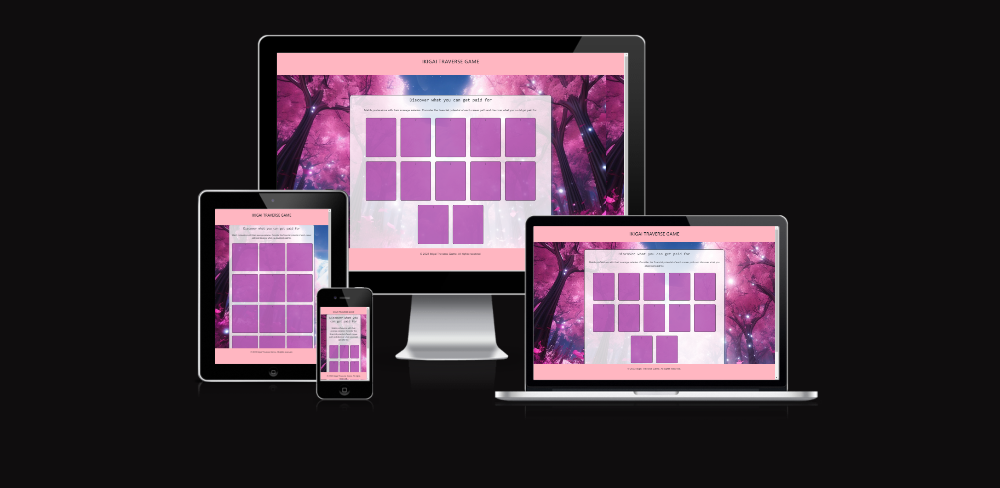

## Table of Contents (Optional)

1. [Planning Stage](#planning-stage)
1. [Features](#features)
1. [Testing](#testing)
1. [Deployment](#deployment)
1. [ Validator Testing](#validator-testing)
1. [Technical Stack](#technical-stack)
1. [Future features](#future-features)
1. [Credits](#credits)

## Planning Stage

Certainly! I've divided the planning stage into subsections to provide a more organized structure:

### Research and Inspiration

The Ikigai Traverse Game was initially developed after substantial research was done to delve deeply into the spirit of IKIGAI, a profound Japanese philosophy that encapsulates "a reason for being." This way of thinking embodies the meeting point of four key ideas: what one excels at, what the world needs, what one enjoys, and what one might be compensated for.

### Choosing the Interactive Approach

The main goal was to expose and discuss these four important areas of life in an interesting and educational way. The decision was between building a traditional information-rich website and an interactive game that combines learning and fun. The latter was chosen after great consideration—a game that would not only inform but also fascinate and inspire.

### Puzzle Games for Self-Reflection

Players have the chance to interact intimately with IKIGAI by playing one of the many puzzle or drag-and-drop games that each represented a different part of the philosophy. Players are urged to start their own personal journey of reflection when each game is finished, thinking about the lessons they learned.

### Game Structure and Design

The layout and structure of the game were conceptualized as the outcome of many brainstorming sessions. It was difficult to create games or puzzles that were both easy to understand and profoundly insightful. The decision was made to build simple yet engaging games that will connect with players personally given the limitations of both resources and time.

### Color Palette

The Ikigai Traverse Game's colour palette was thoughtfully selected to go with the overall style and improve the player's experience. The pink and purple hues were chosen to complement the vivid cherry blossoms in the backdrop image. These vivacious and calming shades were chosen on purpose to give gamers a visually appealing and engaging ambiance.

### Cultural Aesthetics

The background image was intentionally chosen as an homage to Japanese culture; it wasn't chosen randomly. The cherry blossom, or sakura, was chosen to represent the spirit of Japan, bringing a genuine touch to the aesthetics of the game and reiterating its relationship to the IKIGAI school of thought.

### Path to Self-Discovery

The Ikigai Traverse Game was designed to serve as a link between learning and fun, encouraging players to forge their own paths and discover their individual IKIGAI. It is more than simply a game; it is a significant path towards personal growth and self-discovery.

## Features

### Home Page

**Introduction to IKIGAI**
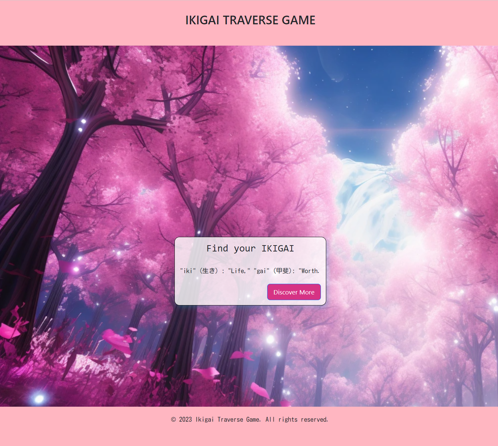

- Before beginning the game, participants are given a brief explanation of IKIGAI to give them background information.
- Users are prompted to "Discover More" about the game by a visually appealing button.

**Information Box**

- When the "Discover More" button is pressed, a box with further information on the game's premise, its relationship to IKIGAI, and how it helps players on their quest for self-discovery appears.

- There are two buttons in this box:

  - **Close:** Permits players to do so and continue perusing the home page after closing the box.

  - **Start Game:** Launches the Ikigai Traverse experience for players right now.

### Love Aspect

**Love Quiz**

- **Interactive Questions:** Take part in a quiz that asks challenging questions designed to invoke introspection about what truly matters to you.

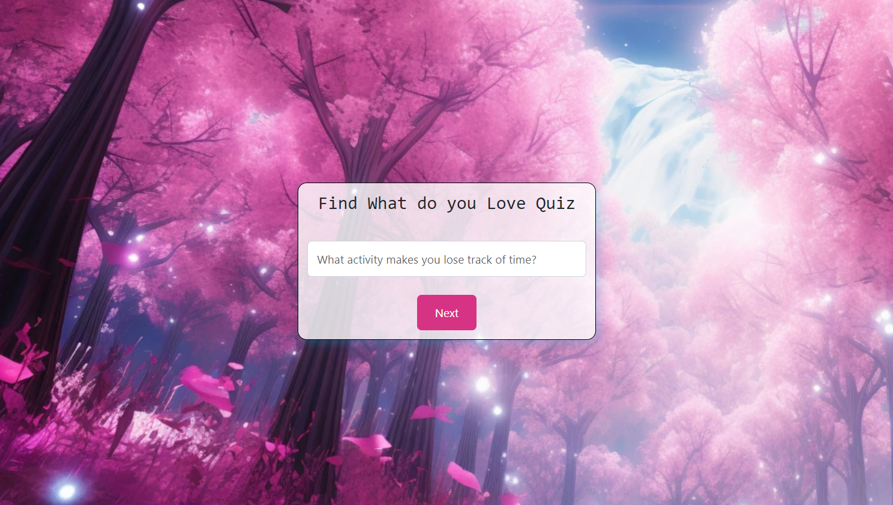

- **Dedicated Reflection Space:** After each question or at the end of the quiz, players have a moment to reflect, making notes or pondering their answers in a designated area.
- **Deep Dive Topics:** Find out more about subjects like "What activity makes you lose track of time?" and challenge yourself to answer honestly.

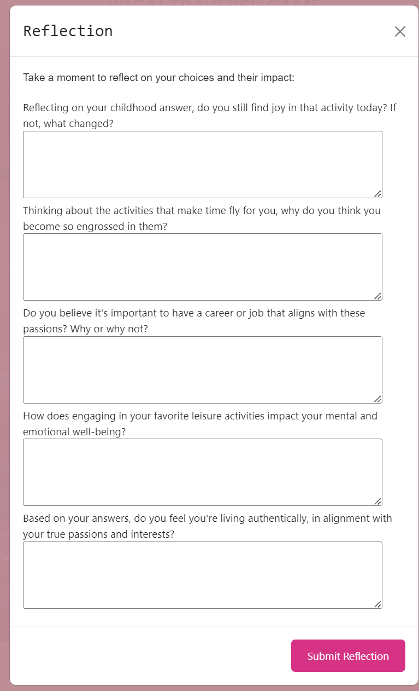

- **Submission Modal:** Once players complete the quiz and click on "Submit", a modal pops up. This modal asks the player if they are ready to move on to the "Mission" game, offering options to either proceed or stay and reflect further on the Love Quiz.

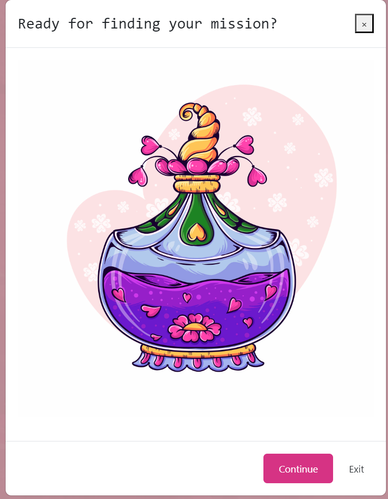

### Mission Aspect

**Drag and Drop Game - Impact Classification**

- **Activity Listing:** Engage in a drag-and-drop game where players organize a list of activities based on their perceived impact.
- **Impact Categories:** Activities need to be grouped into three distinct categories: high, moderate, and low impact, challenging players to prioritize and think critically.

  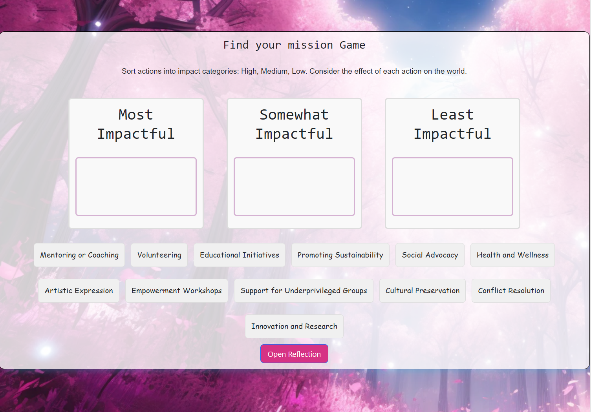
- **Reflection Modal:** After categorizing the activities, players are presented with a reflection modal, prompting them to introspect and consider why they ranked the activities as they did and what potential effects these might have in their life or in society at large.

  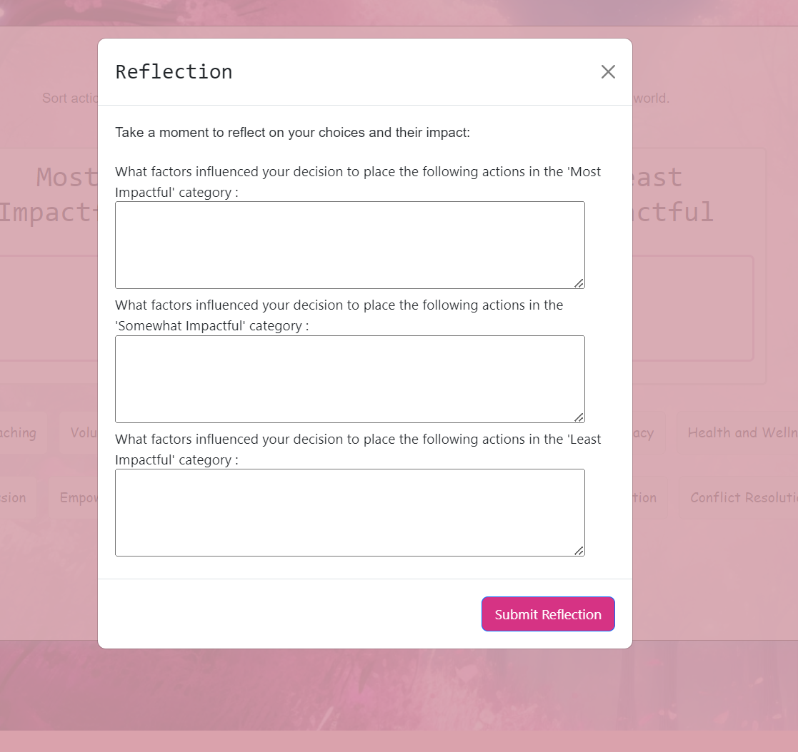

### Profession Aspect

**Drag and Drop Game - Skill Match**

- **Skill-Based Arrangement:** Players are presented with pictures of various vocations. They are tasked with arranging these images based on their personal skills and competencies.
- **Career Recognition:** As players engage with the drag-and-drop mechanic, they will gain insights into which careers might best align with their skill set.

  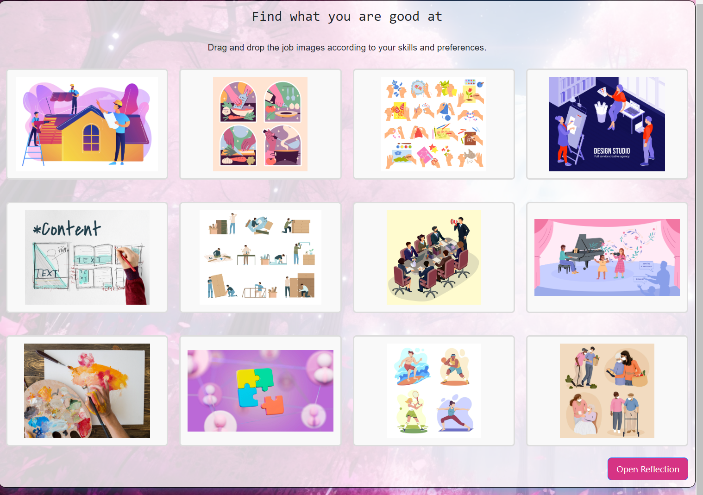
- **Reflection Section:** After organizing the vocations, a dedicated reflection section prompts players to introspect on their choices, nudging them to consider potential career paths and why certain vocations resonated more than others.

  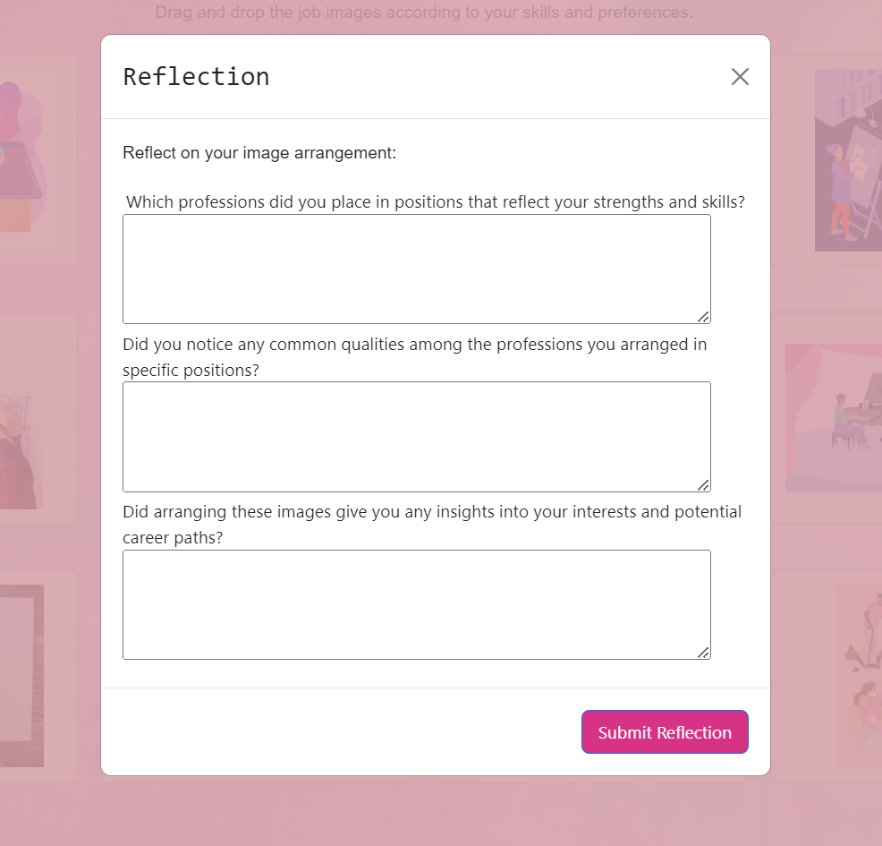

### Vocation Aspect

**Memory Game - Profession and Salary Match**

- **Engaging Memory Challenge:** Players are tasked with a memory game, prompting them to match various vocations with their corresponding salaries.
- **Vocations and Wages Compilation:** The game displays a curated list of vocations and their associated wages, giving players insights into potential earnings in different professions.

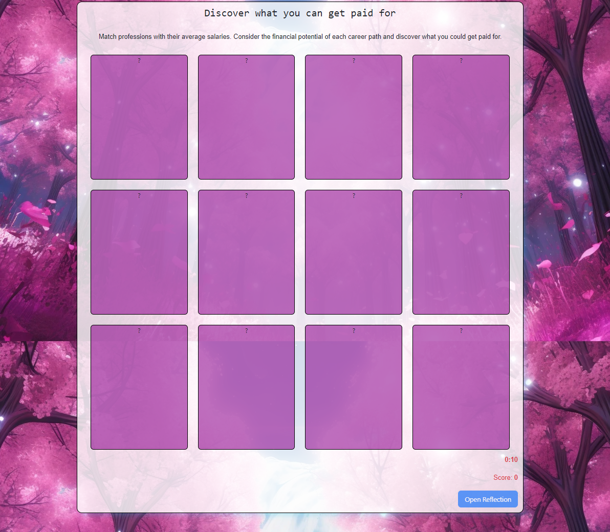

- **Dynamic Card Flipping:** As players flip cards in search of matching pairs, they not only test their memory but also deepen their understanding of different careers.

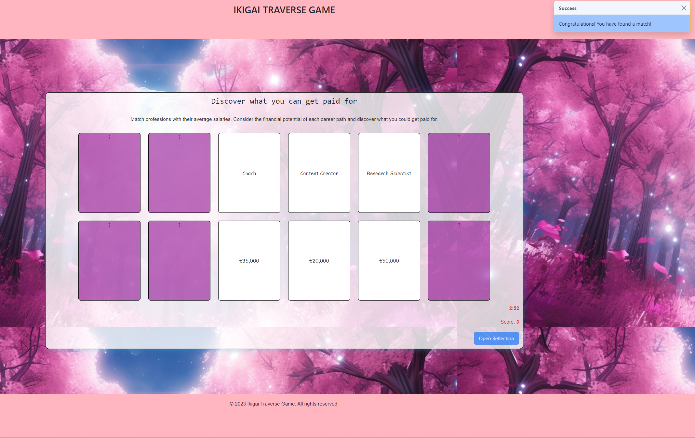

- **Score and Time Tracking:** Players can calculate their score based on correct matches and track the time taken, fostering a competitive edge and the drive to improve.

- **Instant Match Feedback:** Players receive immediate confirmations upon finding correct matches, offering a sense of accomplishment and satisfaction.

These features are intended to provide a fun and instructive experience as you explore the various facets of IKIGAI.

## Testing

During the development of the Ikigai Traverse Game, thorough testing was paramount to ensure an optimal user experience. Here's a summary of the testing methodologies applied:

- **Manual Functionality Testing:** Comprehensive manual tests were carried out across all game features to validate the correctness of functionalities and to ensure that each game operated as expected.

- **Developer Tools:** Extensive checks were conducted using browser developer tools, especially in inspecting console outputs for any potential errors or unexpected behaviors. This ensured that the game runs smoothly without technical glitches.

- **Responsive Design Testing:** The game's responsiveness across various screen sizes and devices was scrutinized. By leveraging browser developer tools, I simulated various device displays to ensure that the game provides a consistent experience irrespective of the device being used.

- **Accessibility Testing with WAVE:** By employing the WAVE (Web Accessibility Evaluation Tool), potential accessibility issues were identified. Addressing these ensured that the game is inclusive and can be accessed and enjoyed by players with varying abilities.

- **User Experience Testing with Unicorn Revealer:** Unicorn Revealer was utilized to detect and diagnose layout issues, especially those related to overflow and scroll. This assisted in making the necessary adjustments to enhance the overall aesthetics and usability of the game.

In essence, a combination of manual and automated testing tools ensured the delivery of a polished, functional, and user-friendly gaming experience.

### Lighthouse Performance Testing

Lighthouse, an all-inclusive tool developed by Google, was harnessed to audit web page performance, accessibility, and other pivotal metrics for this project. Overall, the feedback was highly positive, with each page registering scores above 90 across the majority of metrics.

Nevertheless, there were subtle performance nuances in two specific pages: one embellished with images and another laden with numerous cards. These pages had an average performance score of 74. Despite being within a respectable range, these scores shine a spotlight on potential areas for further refinement. To enhance loading times and performance, all images were converted to the efficient `.webp` format using [FreeConvert](https://www.freeconvert.com/jpg-to-webp) and further compressed via [TinyPNG](https://tinypng.com/). Such measures aim to bolster the rendering efficiencies, especially for pages with a dense visual presence.

## Validator Testing

**HTML:**
Validation was performed using [W3C Markup Validation Service](https://validator.w3.org/nu/#textarea). The results showed no errors or warnings.

**CSS:**
The [CSS Validator at Code Beautify](https://codebeautify.org/cssvalidate) was employed for validation. It highlighted certain elements not being in alphabetical order. However, rearranging them as suggested would compromise the integrity of the game, so they were intentionally left as is.

**JAVASCRIPT:**
The JavaScript code was validated using [JSHint](https://jshint.com/). It returned 68 warnings, primarily concerning the usage of 'const' and 'let' on various lines.

## Deployment

The game has been deployed using GitHub Pages. Here's a step-by-step breakdown of the deployment process:

Navigate to your GitHub repositories and locate the 'Memorygame' repository.
Access the 'Settings' tab located just above the green GitHub button.
On the left side of the page, scroll down and click on the 'Pages' section.
Under the 'Branch' subheading, use the dropdown menu to select the 'main' branch and then click 'Save'.
After selecting the main branch, the page will refresh. A notification will subsequently appear, confirming the successful deployment.

## Technical Stack

**Languages and Frameworks:**

- **JavaScript (JS):** The primary programming language used for the game's logic.
- **jQuery 3.6.0:** A JavaScript library that simplified DOM manipulation and event handling.
- **Bootstrap 5.3.0:** A framework for designing responsive and mobile-first web pages.
- **HTML:** Utilized for structuring the content.

**Libraries:**

- **SortableJS:** An efficient library specifically used to enable the drag-and-drop features in the game.

**Tools:**

- **Webpack:** Employed as a module bundler, allowing for the easy importation of constants into JavaScript files.

## Future Features

1. **Machine Learning for Decision Assistance:** 
   - Integrate machine learning capabilities to process player responses and reflections. This will help in providing more tailored feedback, aiding players in making decisions that resonate with their personal IKIGAI. Potential libraries and frameworks to consider are:
     - **Brain.js:** A GPU accelerated library for training and deploying machine learning models in the browser.
     - **TensorFlow.js:** A JavaScript library by Google that permits the training and inference of neural network models in the browser or on Node.js.
     - **ml5.js:** A library built on TensorFlow.js, offering a higher-level, more user-friendly API for various machine learning algorithms and models.

2. **Dynamic Report Generation:** 
   - Based on the answers and reflections of players, the game would be capable of generating an interactive HTML report. This report can be revisited by players anytime they wish to delve deeper into their responses, monitor their progress, or view insights and suggestions provided by the game.

## Credits

Special thanks to my mentor from CI for her invaluable guidance and insights throughout the development of this project.

### Media Attributions

All images used in this game are sourced from [Freepik](https://www.freepik.com/). Here are the attributions for the specific images:

1. Image by <a href="https://www.freepik.com/free-vector/teacher-set_7966652.htm#page=2&query=teacher%20profession%20man%20women&position=12&from_view=search&track=ais">Freepik</a>
2. <a href="https://www.freepik.com/free-vector/doctors-couple-with-apron-documents_7585916.htm#query=doctor%20profession%20man%20women&position=4&from_view=search&track=ais">Image by studiogstock</a> on Freepik
3. <a href="https://www.freepik.com/free-vector/people-with-technology-devices-illustration_7071861.htm#page=3&query=Content%20Creator%20profession%20man%20women&position=6&from_view=search&track=ais">Image by pikisuperstar</a> on Freepik
4. <a href="https://www.freepik.com/free-vector/people-with-technology-devices-illustration_7071861.htm#page=3&query=Content%20Creator%20profession%20man%20women&position=6&from_view=search&track=ais">Image by pikisuperstar</a> on Freepik
5. <a href="https://www.freepik.com/free-photo/coach-coaching-guide-instructor-leader-manager-tutor-concept_18042303.htm#query=become%20lif%20coach%20profession%20title&position=0&from_view=search&track=ais">Image by rawpixel.com</a> on Freepik
6. <a href="https://www.freepik.com/free-ai-image/magenta-nature-mystical-landscape_58597627.htm#query=cherry%20blossom%20Tree%20anime&position=6&from_view=search&track=ais">Image By freepik</a>
7. <a href="https://www.freepik.com/free-photo/top-view-artist-painting-with-brush-palette_9360722.htm#page=2&query=Painting%20or%20drawing&position=12&from_view=search&track=ais">Freepik</a>
8. <a href="https://www.freepik.com/free-vector/genius-prodigy-flat-composition-with-doodle-style-characters-talented-teenagers-playing-musical-instruments-stage-vector-illustration_63441220.htm#page=13&query=Playing%20a%20musical%20instrument&position=1&from_view=search&track=ais">Image by macrovector</a> on Freepik
9. <a href="https://www.freepik.com/free-vector/bakery-cartoon-set_4267693.htm#page=3&query=Cooking%20and%20baking&position=45&from_view=search&track=ais">Image by macrovector</a> on Freepik
10. <a href="https://www.freepik.com/free-vector/naive-food-illustration-set_22380481.htm#page=3&query=Cooking&position=3&from_view=search&track=sph">Image by pikisuperstar</a> on Freepik
11. <a href="https://www.freepik.com/free-photo/e-book-layout-design-draft-graphic_16462129.htm#page=4&query=Writing&position=48&from_view=search&track=sph">Image by rawpixel.com</a> on Freepik
12. <a href="https://www.freepik.com/free-vector/summer-sports-concept_9469259.htm#page=3&query=Playing%20sports&position=1&from_view=search&track=ais">Image by pikisuperstar</a> on Freepik
12. <a href="https://www.freepik.com/free-vector/furniture-assembly-flat-set-isolated-icons-with-characters-working-people-with-rulers-tools-vector-illustration_26765052.htm#query=Building%20or%20crafting&position=27&from_view=search&track=ais">Image by macrovector</a> on Freepik
13. <a href="https://www.freepik.com/free-vector/building-repair-housetop-renovation-roof-reconstruction-roofing-services-roof-repair-support-peak-roofing-contractors-concept_10782588.htm#page=4&query=Building%20or%20crafting&position=12&from_view=search&track=ais">Image by vectorjuice</a> on Freepik
14. <a href="https://www.freepik.com/free-vector/creative-kids-hands-knitting-embroidering-folding-origami-making-homemade-beads-bracelet-drawing-coloring_6821667.htm#query=Building%20or%20crafting&position=15&from_view=search&track=ais">Image by macrovector</a> on Freepik
15. <a href="https://www.freepik.com/free-vector/creative-agency-design-studio-poster-with-team-interior-designers-working-together-isometric-vector-illustration_58545051.htm#page=18&query=Designer&position=47&from_view=search&track=sph">Image by macrovector</a> on Freepik
16. Image by <a href="https://www.freepik.com/free-psd/abstract-background-with-puzzle_17880139.htm#page=31&query=one%20person%20Solving%20puzzles&position=19&from_view=search&track=ais">Freepik</a>
17. <a href="https://www.freepik.com/free-vector/team-company-people-working-business-project-together-office-workers-meeting-flat-vector-illustration-workflow-teamwork-concept-banner-website-design-landing-web-page_28480843.htm#page=2&query=manager&position=38&from_view=search&track=sph">Image by pch.vector</a> on Freepik
18. Image by  <a href="https://www.freepik.com/free-vector/volunteers-helping-elderly-people-pack_8785690.htm#page=2&query=Helping%20others&position=16&from_view=search&track=ais">Freepik</a>
